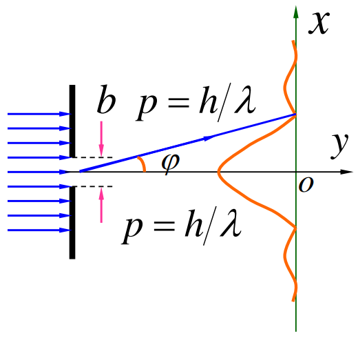

在经典力学中，粒子的运动状态是用位置和动量来进行描述的，而且这两个量可以同时准确的予以测定，这就是经典力学的确定性。因此，可以说确定性是经典力学保持有效的关键。

然而，对于具有二象性的微观粒子，确定性不再能够得到保证。本节将举例论述这一观点并讨论位置与动量之间的不确定性关系。

## 电子衍射

为说明不确定性关系，我们以电子单缝衍射来进行讨论。

假设有一束电子通过宽度为 b 的狭缝，射向投影屏，我们讨论电子通过狭缝时的动量和位置的不确定关系。

当粒子通过狭缝时，其 $Ox$ 方向上的坐标不能直接确定，仅能保证在在狭缝之间，因此其位置在 **$Ox$ 轴**上的不确定度为 $\Delta x=b$；

同时，在这一瞬间尽管电子的动量大小未发生改变，但其方向由于衍射的发生而发生了改变。如图，我们不妨假设粒子的动量仅在主极大范围内，则其衍射角最大值满足 $\sin\phi=\frac{\lambda}{b}$（注意这里不是仅考虑一侧衍射，而是谈论类似于“半径”的概念，如果是小孔衍射就更容易理解了，毕竟只是一个例子，不是严格推导结论）。因此，电子动量在 **$Ox$ 轴上上的动量不确定度满足**：$\Delta p_{x}=p\sin\phi=p\frac{\lambda}{b}$。由德布罗意公式 $\lambda=\frac{h}{p}$，可以改写为：$\Delta  p_{x}=\frac{h}{b}$。

观察两个不确定度关系，可以得到：$\Delta x \Delta p_{x}=h$。由于衍射图样中的次级条纹也可以抵达，因此有关系式：
$$
\Delta x \Delta p_{x}\ge h
$$
## 性质与注意事项

1. 位置的不确定度与动量的不确定度要求在同一方向上。
2. 不确定性的根源是*微观粒子的波动性*。
3. 按照量子力学严格的证明，可以得到不确定性关系满足：$\Delta x \Delta p_{x}\ge \frac{\hbar}{2}$
4. 能量和时间也满足一个不确定性关系（可以用以上不确定性关系推导）：$\Delta E\Delta t \ge \frac{\hbar}{2}$