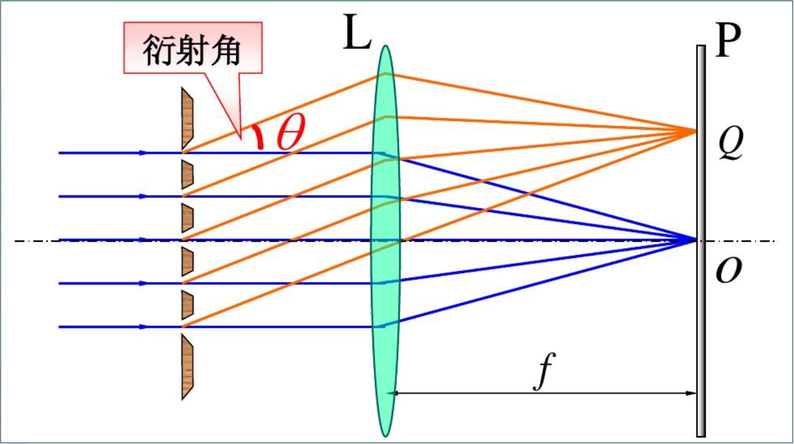

在[光的衍射 > 夫琅禾费单缝衍射](光的衍射#夫琅禾费单缝衍射)中，如果缝较宽，明纹亮度较强但相邻明纹间隔很窄，不容易分辨；如果狭缝很窄，则间隔较宽但亮度显著减小。为了获得既明亮又狭窄的衍射条纹，我们设计了*衍射光栅*用于实现这样的目的。

## 光栅基本量

光栅的种类多种多样，既有透射光栅，也有反射光栅。大学物理实验常用的是透射光栅。在不透光的材质上刻画许多可以透光的“单缝”，若干平行排列的等间距、等宽度的狭缝就构成了*透射式平面衍射光栅*。

一般称单个**狭缝宽度**为 b，两**狭缝间距**为 b'，称 d=b+b' 为**光栅常量**。一般的光栅常量为 $10^{-6} \sim 10^{-5}$。

## 光栅条纹的形成

光栅中的每一条透光缝都会由于衍射在屏幕上呈现衍射图样，同时，由于各缝所发出的光都可以看作是利用[波振面分割法](相干光#波振面分割法)得到的相干光，故不同缝之间的衍射条纹也会发生干涉，也就是说光栅的衍射条纹是*衍射和干涉的总效果*。

类比与[双缝干涉](杨氏双缝干涉与劳埃德镜#杨氏双缝干涉实验)，光栅中相邻两狭缝的光程差为：$\Delta = d\sin\theta$，自然而然的，当满足加强条件 $\Delta=\pm k \lambda, k=0, 1, 2\dots$ 时各个狭缝之间都呈现相干加强。

## 光栅条纹光强（干涉考虑）

通过某些数学推导，可以得到光栅强度公式：
$$
\begin{align}
设~~\alpha&=\frac{\pi b \sin\theta}{\lambda} \\
\beta&=\frac{\pi d \sin\theta}{\lambda} \\
用上述&两变量来分析光强\\
则有 ~I_{\theta}&= I_{10}(\frac{\sin\alpha}{\alpha})^{2}(\frac{\sin N \beta}{\sin\beta})^{2}
\end{align}
$$
式中第一项为**单缝衍射因子**，第二项为**多缝干涉因子**。

我们按照*多缝干涉因子*的极值情况来进行讨论：
1. 当*多缝干涉因子*为最大值 $N^{2}$ 时，也即 $\beta=k\pi, k=0,\pm 1 \dots$ 时，光强有 $I=N^{2}I_{10}$，此时为主极大明纹。
2. 当 *多缝干涉因子*为 0 时，也即 $N\beta=k'\pi, k'=1, 2, 3\dots 且 k'\ne N, 2N, 3N\dots$ 时，光强为 0，也即为暗条纹。通过数学关系可以知道，在两个主极大条纹间有 N-1 个极小条纹。
3. 根据上述原理，在非这两种的情况下，会有 N-2 个次极大条纹。

## 缺级现象（衍射考虑）

根据 [光的衍射 > 夫琅禾费单缝衍射](光的衍射#夫琅禾费单缝衍射)中推导的结论，衍射*暗条纹*满足条件：$b\sin\theta=\pm k \lambda, k=1, 2, 3\dots$。再根据 [光栅条纹的形成](#光栅条纹的形成)中就干涉推导的*明条纹*的条件：$d\sin\theta=\pm k'\lambda, k'=0, 1, 2\dots$，当明条纹（主极大条纹）本应出现时若恰好还满足衍射暗条纹条件，**也即满足 $\frac{d}{b}=\frac{k}{k'}$**，就会在 $k=k'\frac{d}{b}$ 级处出现**缺级现象**。

例如，当 $\frac{d}{b}=4$ 时，则在 $k=\pm 4,\pm 8,\pm 12\dots$ 级处缺级；当 $\frac{d}{b}=\frac{3}{2}$ 时，则在 $k=\pm 3,\pm 6,\pm 9 \dots$ 处缺级。

缺级现象的本质是光栅条纹受单缝衍射的调制。

## 相关二级结论

**亮条纹最大级数**：综合上述两公式可以得到：$d \sin \theta = \pm k \lambda \rightarrow \sin\theta_{k}=\pm \frac{k\lambda}{d}$ 。由于 $\theta_{k}$ 是角，有最大值 $\frac{\pi}{2}$，则可见亮条纹数目有最高级数：k= $\frac{d}{\lambda}$

**条纹间距**：由 $d \sin \theta = k \lambda$，取其差式，有 $d \Delta\sin \theta = \Delta k \lambda$。取 $\Delta k=1$，则有相邻两条纹有：$\sin\theta_{k+1}-\sin\theta_{k}=\frac{\lambda}{d}$。考虑到光栅衍射衍射角一般较大，则实际观察结果体现为不等距条纹。根据该公式也可以了解到*光栅常数越小，波长越大，亮条纹越窄，亮条纹间隔越远*。

## 衍射光谱（应用）

入射光为白光时，光栅条纹的结果为彩色的衍射光谱。经计算，在可见光范围内，第一级光谱与第二级光谱无重叠，但后续级别都会有重叠。

**光谱张角**：从最大波长 760nm（红光）的衍射角（*注意如果超出 90 度就用 90 度*）减去最小波长 400nm（紫光）的衍射角得到角即为张角。

经计算可知，第二级光谱与第三级光谱的重叠部分为 600-760nm。