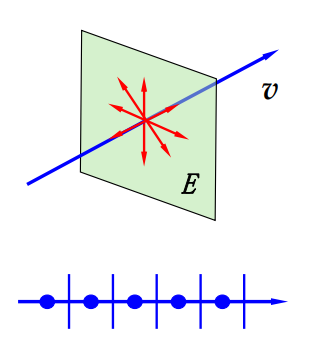
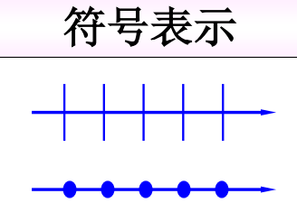
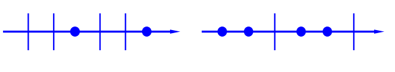
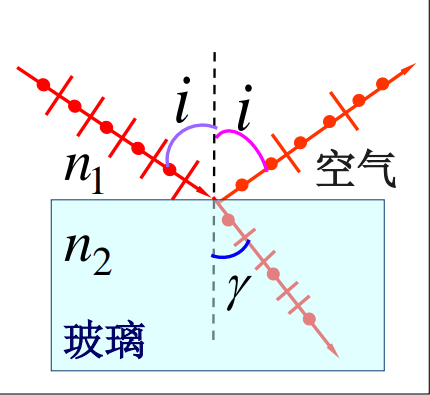

横波和纵波在许多方面的表现是截然不同的。例如，横波可以发生偏振现象而纵波不可以。根据 [电磁波和声波 > 平面电磁波](电磁波和声波#平面电磁波)的讨论可以知道电磁波是横波，所以自然而然的，光作为一种电磁波也自然是横波，因此也可以对于光波来讨论偏振现象。本节便针对光的偏振开展讨论。

## 光的分类（按照偏振特性）

根据光的偏振特性，可以将光分为 5 大类：
1. 自然光
2. 线偏振光（完全偏振光）
3. 部分偏振光
4. 椭圆偏振光
5. 圆偏振光

### 自然光

一般光源发出的光包含着各个方向的光矢量，其相互独立，没有纳衣方向占优势，成这种光焦作自然光。

按照矢量合成与分解原理，在任意时刻我们都可以把各个个光矢量分解为两个互相垂直的光矢量分量，再通过合成得到两个总光矢量的分量。一般用*带有点线相间的条纹的箭头*表示自然光。

另外，自然光中的各个光振动相互独立，所以上述提到的*总光矢量*的分量之间**没有恒定的相位差（为了区别椭圆偏振光和圆偏振光）**

### 线偏振光

自然光经反射、折射或吸收后，仅保留某一方向上的光振动，我们成这种光为**线偏振光**，简称*偏振光*，偏振光的振动方向与传播方向组成的平面我们成为*振动面*。

### 部分偏振光

如果不止存在一个振动面，而是在各个方向上都存在光振动，但*振幅不等，各个方向的光振动间不存在确定相位关系（排除椭圆偏振光与圆偏振光）*，则称这种光为*部分偏振光*。

## 偏振光的产生

除去某些特定的光源，大多数光源所产生的光都是自然光。使自然光成为偏振光的方法很多，本节主要介绍两种（三钟）方法。

### 吸收起偏与马吕斯定律

#### 吸收起偏

某些物指能够吸收某一方向的光振动，而只让与这个方向垂直的光振动通过，这种性质称为*二向色性*。将具有二向色性的材料涂抹摘透明薄片上，就做成了*偏振片*，能够通过其的光的方向被叫做*偏振化方向*。

一般来说，我们将能够把自然光变为线偏振光的装置叫做*起偏器*，把用来检验一束光是否为偏振光的装置称为*检偏器*。

#### 马吕斯定律

正如上文提到的，当光通过起偏器后，如果在通过检偏器，其光强必然会发生变化。为了定量的描述这一变化，我们引入马吕斯定律。

我们从振幅角度入手，设起偏器与检偏器之间有夹角 $\alpha$。假设自然光通过起偏器后的振幅为 $E_{0}$，则在通过检偏器时，只有平行于检偏器的偏振化方向的分量可以通过。故其通过的振幅为：$E=E_{0}\cos\alpha$，根据光强与振幅的关系，可以得到检偏器中射出的光强为：$I=I_{0}\cos^{2}\alpha$。

### 光反射与折射时的偏振

光在介质表面发生反射与折射时会产生偏振现象。一般情况下，反射光与折射光都是**部分**偏振光。反射光垂直入射面的振动大于平行与入射光的振动，折射光反之。同时，*理论和实验证明，反射光的偏振化程度与入射角有关*。

通过大量实验研究，得到了**布儒斯特定律：当入射角的正切值等于折射率时，反射光为完全偏振光，且振动面垂直入射面，折射光为部分偏振光。**

另外，根据几何光学，还有结论如下：
1. 反射光与折射光互相垂直；
2. 当入射光以折射角 $\gamma$ 从介质中入射空气时，此 $\gamma$ 角为布儒斯特角。

同时，单一反射/折射起偏的振动幅度很小，因此一般通过*玻璃片堆*来产生偏振光。

## 双折射

对于光学性质不各向同性的某些经体，当光线进入晶体后，一束光线可以有两束折射光。其中一束符合折射定律的叫寻常光线（*o 光*），不遵循折射定律的叫非常光线（*e 光*）。这种现象被称作**双折射现象**。

这类晶体中存在一个方向，当光沿这个方向入射时不发生双折射现象，这个方向被叫做双折射晶体的**光轴**。

对于双折射现象有以下定义：
1. 入射表面的发现与晶体的光轴所构成的平面叫做**主截面**；
2. 折射光线与光轴所成的平面叫做**主平面**；
3. 入射光线与晶体表面法线所成的平面叫做**入射面**；
4. 真空光速 $c$ 与光沿垂直于光轴方向的传播速度 $v_{e}$ 的比叫做**主折射率 $n_{e}$**；
5. 一般的折射率称为 $n_{o}=\frac{c}{v_{o}}$，各方向折射率在 $n_{o}$ 与 $n_{e}$ 之间；
6. $n_{e}>n_{o}$ 称为**正晶体**，反之称为负晶体。
7. 光线与非常光线都是完全偏振光，寻常光线的振动方垂直于主截面，非常光线的振动方向平行于主截面。

通过惠更斯原理可以定性解释双折射现象，这里不加赘述，只给给出重要的应用**半波片**与**四分之一波片**：

1. 对于厚度 $d$ 满足 $d=\frac{\lambda}{4(n_{o}-n_{e})}$ 的晶片，光垂直其入射后出射的光会产生 $\frac{\pi}{2}$ 的相位差，这种晶片被称为**四分之一波片**
2. 对于厚度 $d$ 满足 $d=\frac{\lambda}{2(n_{o}-n_{e})}$ 的晶片，光垂直其入射后出射的光会产生 $\pi$ 的相位差，这种晶片被称为**半波片**