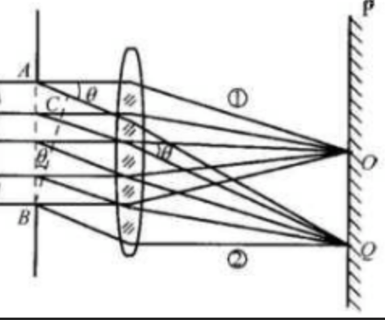

光是一种电磁波，因此其自然具有[衍射现象](惠更斯原理、衍射和干涉#波的衍射)。其如果在传播过程中遇到吃醋内闭光的波长大的不多的障碍物时就会在障碍物的阴影区形成明暗变化的条纹，这就是光的衍射。

本节将整体性从惠更斯-菲涅耳原理入手，首先整体性的介绍光的衍射现象，然后就两种电典型研究的衍射中的夫琅禾费衍射就行具体探讨。

## 惠更斯-菲涅耳原理

尽管[惠更斯原理](惠更斯原理、衍射和干涉#惠更斯原理)能够定性的解释波的衍射，但其对于定量计算无能为力。作为惠更斯原理的补充，菲涅耳根据波的叠加和干涉原理，提出了“子波相干叠加”的概念——同一波面上的各点的子波是相干的，其在传播到空间的某一点时各子波相干叠加的结果决定该点的振幅。

在该原理的基础上发展起来的衍射理论已经能够对空间中的衍射进行定量描述：设空间中的光矢量为 $\vec E$，则有：
$$
E=C\int \frac{K(\theta)}{r}\cos[2\pi(\frac{t}{T}- \frac{r}{\lambda})]dS
$$
其中 $K(\theta)$ 是随 $\theta$ 增大而减小的*倾斜因数*，T 和 $\lambda$ 分别是周期和波长。

## 菲涅耳衍射和夫琅禾费衍射

根据光源、衍射孔、光屏三者之间的相互位置可以把衍射大体上分为两种：菲涅耳衍射和夫琅禾费衍射。

对于光源和光屏都距离衍射孔*无限远*的衍射，称为**夫琅禾费衍射**，如果二者之中任意一个为有限远则称之为**菲涅耳衍射**。在实验中，常把光源放在透镜的交点上，从而得到平行光线，进而得到满足**夫琅禾费衍射条件**的入射光。考虑到夫琅禾费衍射较为简单且应用较广，故以其为主要研究对象。

## 夫琅禾费衍射

### 夫琅禾费单缝衍射

#### 条纹概述

如图所示为夫琅禾费单缝衍射原理图。设图中干涉宽度为 b。下面开始对该衍射进行讨论：
1. 中央明纹：从垂直与光屏入射的光在几何上没有光程差，且透镜也不附加额外光程差，故中央条纹为明条纹；
2. 对于与入射方向成 $\theta$ 角的子波射线，称其与水平方向的夹角 $\theta$ 为衍射角，其被透镜汇聚在光屏上的 Q 点，由于其该部分的光各点的光程差并不相同，且其的粗昂成差*全部*产生在 AB 都 BC 之间。

#### 半波带法分析

此时如果对每一点都进行考虑，便需要面对较为复杂的数学问题。为避免复杂度过高，我们采用**半波带法**对其进行分析：
1. 首先假设 AC 之间的距离是半波长的整数倍，将其分割为若个长度为半波长的小波带；
2. 每两个小波带之间会发生相消干涉，依次抵消；
3. 按照如此推导，如果 AC 长度为偶数个半波长则会刚好完全相消，出现暗条纹中心；如果为奇数个半波长则会剩余一个小波带，出现明条纹中心；而如果不为整数倍的话则会在这两种情况的过渡地带，呈现连续的明暗变化的情况；
4. **同时，对于统一狭缝而言，半波带数量越多的话，每个半波带的能量越小，子波振幅越小，故明条纹也会随着衍射角 $\theta$ 的增大而逐渐减小**；
5. 另外，由于要分割半波带，所以使用该方法时对于 AC 波长大小有限制：**至少一个**。

#### 结论

通过上述分析过程可以得到**暗条纹**的公式：
$$
b\sin\theta=\pm k \lambda,k=1,2,...
$$
对应于 k=1, 2,... 我们将其称为第一级暗条纹、第二级暗条纹...

同理，也可以得到**明条纹**的公式：
$$
b \sin \theta = \pm (2k+1) \frac{\lambda}{2},k=1,2,3,...
$$
对应于 k=1, 2,... 我们将其称为第一级明条纹、第二级明条纹...

**再次强调，半波带法推导的条纹不包括中央亮条纹**。同时，针对亮条纹公式 k=0 的情况，其被*合并*在中央亮条纹之中了，所以不会形成单独的中央亮条纹。

最后，当衍射角变大时，亮暗条纹的区别会迅速减小，一般只能看到中央几条两条亮条纹。

#### 条纹间距

正如上一部分所言，单缝衍射的衍射角一般很小，所以有近似条件：$\sin\theta\approx\tan\theta$，可以写出光屏上条纹距离中心的距离为：
$$
x=f\tan\theta\approx f\sin\theta
$$
$f$ 为透镜到光屏的距离。例如，第一级安慰到光屏中心的距离为 $x=\frac{\lambda}{b} f$，故*中央条纹宽度为 $\frac{2\lambda}{b}f$*。

分析上式也可以进一步知晓，当狭缝宽度很小、波长较大时，衍射角更明显。

### 夫琅禾费圆孔衍射

#### 艾里斑

参考夫琅禾费单缝衍射，可以得到夫琅禾费圆孔衍射的众多性质，再次便不再赘述。仅对必要内容进行补充

夫琅禾费圆孔衍射的中央光斑较量，称为**艾里斑**，其直径参考上文的 [条纹间距](#条纹间距)，通过理论计算分析，可以得到在满足夫琅禾费圆孔衍射条件下，其*对透镜张角 $\theta$，波长 $\lambda$，圆孔直径 $D$* 满足：$\theta = \frac{d}{f}=1.22\frac{\lambda}{D}$

#### 光学仪器分辨能力

由于衍射现象，通过仪器进行观察时一个物点会对应一个具有一定大小的艾里斑，对于两个很接近的观察点会出现艾里斑的重叠。如果瓦全重叠则无法进行分辨。故一般规定**两艾里斑圆心距离等于艾里斑半径时为恰能分辨的极限**，称这个判断依据为**瑞利判据**。对应的角度两点对透镜光心的张角为**最小分辨角 $\theta_{0}$**，有 $\theta_{0}=1.22 \frac{\lambda}{D}$。

在光学中，称最小分辨角的导数 $\frac{1}{\theta_{0}}$ 为分辨本领。

**最后，上述讨论时两光点非相干叠加（通常情况），如果是相干叠加要单独处理。**

## 夫琅禾费单缝衍射做题结论

1. 缝宽对中心明条纹的影响：缝宽越大，中心明条纹宽度越小；
2. 狭缝平移对明条纹的影响：没有影响
3. 透镜平移对明条纹的影响：透镜向那个方向移动则明条纹向那个方向移动。