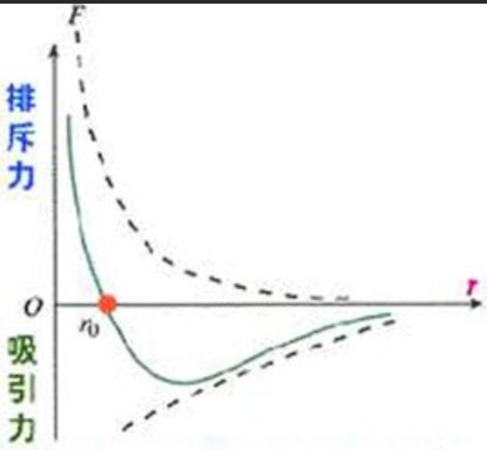

本节涵盖 12-1 到 12-4 几章节的主要内容，主要对这两张章的研究对象进行了定义。

## 气体的物态参量与平衡态

在研究大量做热运动的分子构成的气体状态时，对一定量的气体，我们往往可以用气体的体积 $V$，压强 $p$，热力学温度 $T$。我们称 *体积，压强，热力学温度*称为气体的**物态参量**。这三种量都是**宏观量**。而描述分子各自具有的质量，速度，动量，能量称为**微观量**。

将一定*质量（？）* 放在一定给定体积的容器内，经过一段较长的时间后，容器内各部分气体的压强，温度相同，此时气体的各物态参量都有确定的值。如果如果容器内的气体与外界之间没有能量与物指的传递，气体的能量也没有转化为其他形式的能量，气体的组成及其质量均不随事件变化，则气体的物态参量将不随时间而变化，这样的状态叫做**平衡态**。同时，我们将气体状态变化很小以至于可忽略不计的状态称为**准静态**。

处在**平衡态**的气体状态可以用一组 $p,V,T$ 的值来表示，也可以用**以 p 为纵轴，V 为横轴的 p-V 图象上的一个确定的点来表示**。

## 理想气体物态方程

### 理想气体

对于一定量的正常气体，其*在温度不太低，压强不太大*的实验条件下，将满足三大气体实验定律（玻意耳定律，盖-吕萨克定律，查理定律）。我们*假设*存在一种气体在任意条件下都满足上述三大定律与阿伏伽德罗定律，则称其为**理想气体**。绝大多数气体在*温度不太低，压强不太大*的条件下都可近似看作理想气体，也因此对理想气体的研究也可被便捷的应用于大多数情况。

>  气体实验定律（experimental laws of gas）,即关于气体热学行为的5个基本实验定律，也是建立理想气体概念的实验依据。这5个定理分别是：①玻意耳定律、②查理定律、③盖—吕萨克定律、④阿伏加德罗定律、⑤道尔顿分压定律。

### 物态方程

对于处于平衡态的一定量气体，当*物态参量*中任意一个参量发生变化时，其他两个参量也一般随之改变，但他们三者之间会满足一定的约束条件，其中一个量是其他两个量的函数。例如：$T=f(p,V)$。对于一般的气体物态方程，其形式较为复杂。为了便于讨论，我们仅考虑*理想气体的物态方程*。

由气体实验定律，我们可以总结出**平衡态**下*理想气体的物态方程*：
$$
pV=NkT
$$
其中 N 是体积 V 中的气体分子数，k 称为波尔兹曼常量，一般计算时取
$$
k=1.38\times 10^{-23}J\cdot K^{-1}
$$
再利用阿伏伽德罗定律，使用*物质的量*来更新公式，可以得到：
$$
pV=\nu RT
$$
此时 R 也是一个常量，其满足：
$$
R=N_{a}k=8.31J\cdot mol^{-1}\cdot K^{-1}
$$
另外，如果我们定义 $N/V=n$ 为气体的**分子数密度**，则有
$$
p=nkT
$$
在标准大气压与 $0^{\degree}C$ 的条件下，气体的分子数密度为 $n_{0}=2.69\times 10^{25}m^{-3}$，称为*洛施密特常量*。

## 热力学第零定律

如果物体 A 和 B 分别于处于确定状态（平衡态或准静态）的物体 C 处于热平衡状态，则 A 和 B 也就处于热平衡状态，这被称为**热力学第零定律**。

## 分子的线度与分子力

**分子的线度**：气体分子的平均距离远大于气体分子的直经，因此在标准状态下的气体分子的尺寸可以忽略不计，可以看作质点。

**分子力**：

上图为分子力 F 与分子间距 r 的关系曲线。在分子间距小于 $r_{0}$ 时分子力表现为斥力；在分子间距大于 $r_{0}$ 时，分子力表现为引力。当 r 大于 $10^{-9}m$ 时分子间作用力可忽略不计。

## 分子热运动的无序性及统计规律性

无序形式气体分子热运动的**基本特性**

在大量偶然的，无序的分子运动中，包含着一种规律性。这种规律性来自大量偶然事件的集合，其统称为**统计规律性**。

## 理想气体的微观模型

大量分子做热运动时具有一种有别于力学统计规律性的统计规律性。我们可以用统计方法，求出与大量分子运动有关的一些物理量的平均值，如*平均能量，平均速度，平均碰撞频率等*，从而对与大量气体分子运动相联系的宏观现象做出微观解释。

从气体动理论的观点来看，理想气体是一种理想化的气体模型，其微观模型是：
1. 分子本身大小与分子间*平均距离*相比可忽略不计，分子可以看作质点；
2. 除碰撞的瞬间外，*分子间相互作用力*可忽略不计，两次碰撞之间分子做匀速直线运动；
3. 气体分子间的碰撞以及气体分子与气壁的碰撞可看作*完全弹性碰撞*。