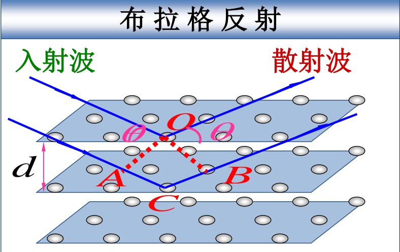

## 第九章振动

- [简谐振动基本量](简谐振动基本量.md)
- [单摆与复摆](单摆与复摆.md)
- [简谐振动的能量](简谐振动的能量.md)
- [简谐振动的合成](简谐振动的合成.md)
- [阻尼振动、受迫振动和共振](阻尼振动、受迫振动和共振.md)
- [电磁振荡](电磁振荡.md)
- [旋转矢量法](旋转矢量法.md)
- [振动考题汇总整理](振动考题汇总整理.md)

## 第十章

- [机械波的概念](机械波的概念.md)
- [平面简谐波的波函数](平面简谐波的波函数.md)
- [波的能量](波的能量.md)
- [惠更斯原理、衍射和干涉](惠更斯原理、衍射和干涉.md)
- [驻波](驻波.md)
- [多普勒效应](多普勒效应.md)
- [电磁波和声波](电磁波和声波.md)

## 光学

- [光程与光程差](光程与光程差.md) *做题注意：当在方程中使用光程时，式中的 $\lambda$ 只能为真空波长。*
- [相干光](相干光.md)
- [杨氏双缝干涉与劳埃德镜](杨氏双缝干涉与劳埃德镜.md)
- [薄膜干涉](薄膜干涉.md)
- [光的衍射](光的衍射.md)
- [光栅衍射](光栅衍射.md)
- X 射线衍射：布拉格公式—— $2d\sin\theta=k\lambda, k=0, 1, 2\dots$。$\theta$ 是 X 射线与原子层之之间的夹角，被曾为*掠射角*，满足条件的 $\theta$ 才会互相加强，此时的掠射角被称为*布拉格角*。
- [光的偏振](光的偏振.md)

## 气体动理论

物体的运动形式多种多样。本章讲究物体的热运动进行研究。研究热运动的方法主要由宏观条件下的热力学与微观条件下的统计力学两种方法。本章（第十二章）将主要使用统计力学方法对气体热运动进行研究。

- [基本描述](基本描述.md)
- [理想气体的压强公式](理想气体的压强公式.md)
- [理想气体分子的平均平动动能与温度的关系](理想气体分子的平均平动动能与温度的关系.md)
- [能量均分定理与理想气体内能](能量均分定理与理想气体内能.md)
- [麦克斯韦气体分子速率分布](麦克斯韦气体分子速率分布.md)
- [波耳兹曼能量分布律](波耳兹曼能量分布律.md)
- [分子的平均碰撞频率和平均自由程](分子的平均碰撞频率和平均自由程.md)

## 热力学基础

上一章从气体分子热运动的观点出发，运用统计方法对热运动的规律和理想气体的一些热学性质进行了研究，而本章则从**能量**观点出发，通过能量来研究物质热现象的宏观基本基本规律及其应用。
- [基本描述（能量观点）](基本描述（能量观点）.md)
- [热力学第一定律和内能](热力学第一定律和内能.md)
- 热力学第一定律的应用：热力学过程分析
	- [理想气体的等容过程和等压过程](理想气体的等容过程和等压过程.md)
	- [理性气体的等温过程和绝热过程](理性气体的等温过程和绝热过程.md)
	- [多方过程](多方过程.md)
	- [循环过程与卡诺循环](循环过程与卡诺循环.md)
- [热力学第二定律与卡诺定理](热力学第二定律与卡诺定理.md)
- [熵与熵增原理](熵与熵增原理.md)

## 量子物理学

作为现代物理的重要组成部分，量子物理学诞生于“经典物理学的乌云”之中。本节从“乌云”中出发，按照历史顺序了量子物理学的诞生背景与研究历程，并对相关重要概念与理论进行了探讨。

- [黑体辐射与普朗克能量子假设](黑体辐射与普朗克能量子假设.md)
- [光电效应与波粒二象性](光电效应与波粒二象性.md)
- [康普顿效应](康普顿效应.md)
- [德布罗意波与实物粒子的二象性](德布罗意波与实物粒子的二象性.md)
- [不确定关系](不确定关系.md)
- [量子力学简介](量子力学简介.md)
- [氢原子的波尔理论](氢原子的波尔理论.md)
- [氢原子的量子理论](氢原子的量子理论.md)

## 其他材料

- [教学日历22](教学日历22.pdf)
- [大物清华题库_修正版](大物清华题库_修正版.pdf)
- [大物下期末备考](大物下期末备考.canvas)

