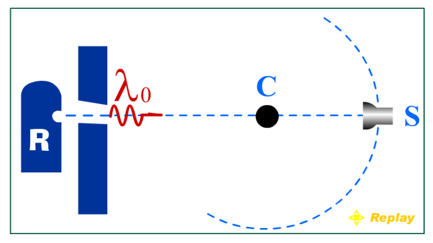
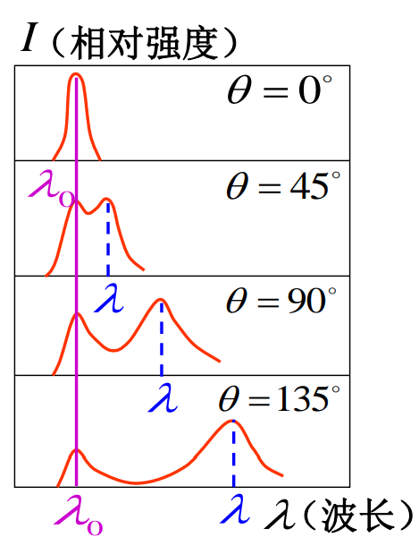
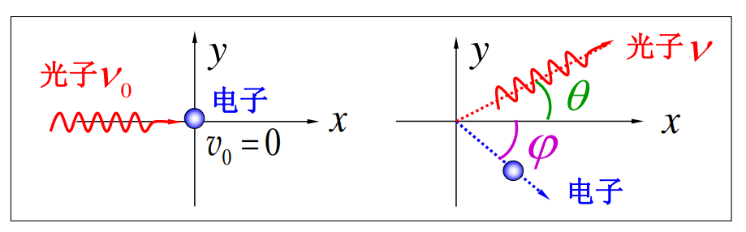
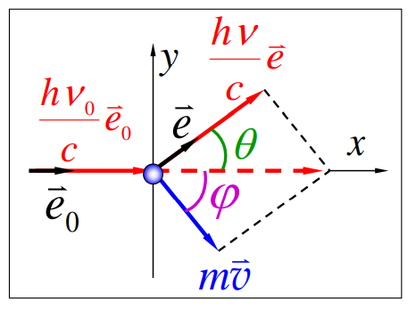

光子与电子发生作用从而体现其粒子性的实验除了光电效应实验以外，还有许多其他类型的实验。其中较为重要的便是康普顿效应。

## 研究历史

1920 年，美国物理学家康普顿在观察 X 射线被物质散射时，发现散射线中含有波长发生了变化的成分——散射束中除了有与入射束波长 $\lambda_{0}$ 相同的射线，还有波长 $\lambda$ > $\lambda_0$ 的射线。

然而根据经典电磁理论，单色电磁波对于比其波长更小的带电粒子的作用是类似于受迫振动的效应，其只会辐射出统一频率的电磁波。但是，在康普顿效应的实验中确实处出现了其他频率的电磁波。

为了解释实验的现象，康普顿提出根据光子假说，特殊波长的产生可能与光电子与受束缚电子之间的*类弹性碰撞*有关。

其假说的理论分析和实验结果最终被证明相一致。这不仅有力的进一步证明了光子学说的正确性，也证实了**微观粒子在相互作用中也严格遵循能量守恒定律和动量守恒定律**。

## 实验现象的量子模型

入射光子的能量较大，而因为电子的速度远小于光子的速度，所以其可以近似的看作静止不动，二者发生完全弹性碰撞（实际上过程应该是电子先吸收后发出光子）。

1. 入射的光子与散射物质中束缚较微弱的电子发生弹性碰撞，一部分能量传递给光子，光子频率下降，波长增大，*主要体现为新出现的峰值*
2. 而光子与被束缚较紧密的电子发生碰撞时，其近似与整个原子发生弹性碰撞。由于原子的动量较大，因此光子的能量不会发生显著下降，*主要表现为波长相同的峰值*。

如果要对该过程进行定量计算，则需要使用动量守恒与能量守恒定律：
$$
\begin{align*}
h\nu_{0}+m_{0}c^{2}&=h\nu+mc^{2}\\
\frac{h\nu_{0}}{C}\vec e_{0}&=\frac{h\nu}{c}\vec e + m \vec v
\end{align*}
$$

（上述公式为矢量式，相关示意图如下）

通过一系列计算，可以最终得到康普顿位移（波长的该变量）的公式：$\Delta \lambda = \frac{h}{m_{0}c}(1-\cos\theta)=\lambda_{C}(1-\cos\theta)$

其中的康普顿波长为：$\lambda_{C}=2.43\times 10^{-12}m=2.43\times 10^{-3}nm$

### 结论

1. 散射光的波长该变量仅与散射角 $\theta$ 有关。
2. 散射光子的能量减小（频率减小，波长增大）。
3. 光具有波粒二象性：光在传播过程中，波动性较为显著；光与物质相互作用时，粒子性比较显著。
4. 若 $\lambda_{0}>>\lambda c$，则无法观察到康普顿效应（可见光观察不到康普顿效应）。
5. $\Delta \lambda$ 与 $\theta$ 的关系和**物质无关**，是光子近自由电子之间的相互作用。

## 物理意义

1. 康普顿效应证明了光子假设的正确性，证明了狭义相对论理学的正确性；
2. 微观粒子的相互作用也遵守能量守恒和动量守恒定律。

## 考题

波长 $\lambda_{0}=1.00\times 10^{-10}m$ 的 X 射线与静止的自由电子作弹性碰撞，在与入射角成 $90\degree$ 角的方向上观察，试求：

1. 散射波长的改变量（康普顿位移）$\Delta \lambda$ 是多少？
2. 反冲电子得到多少动能？
3. 在碰撞中，光子的能量损失了多少？

结题流程：
1. 该部分的核心工具是康普顿位移的公式。通过散射角确定康普顿位移。
2. 利用康普顿位移和能量公式进行能量运算。这里由于涉及波长，故常用 $E=\frac{hc}{\lambda}$ 来表示能量进行运算。
3. 如果涉及到更具体的角度的运算，则需要使用动量守恒和能量守恒来具体运算，相当于完成二维平面上的完全弹性碰撞问题的求解。