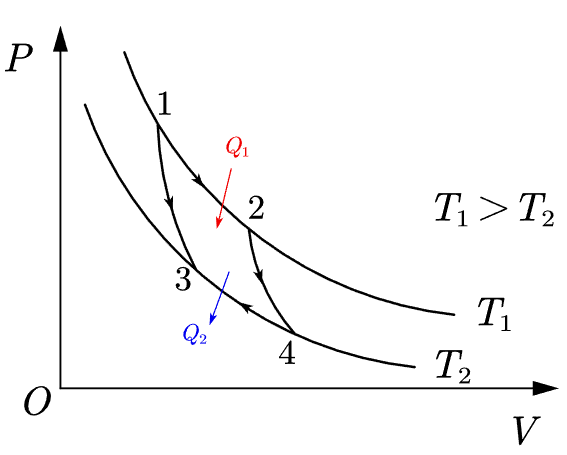

## 循环过程

在生产技术上要求将热和功之间的转化持续的进行下去，这就需要利用循环过程。*系统经过一系列状态变化后，又回到原来状态的过程*叫做*热力学循环过程*，简称**循环**。

对于气体在循环过程中所做的功，我们往往用 p-V 图上的面积来表示。*在任何一个循环过程中，系统所做的静功都等于 p-V 图上所示循环所包围的面积*。同时，因为*内能是系统状态的单值函数，所以系统在经历一个循环过程后，其内能没有改变*。

## 热机与制冷机

按循环进行的方向，我们可以把循环过程及其对应的热机分为两类。

1. 在 p-V 图上按顺时针方向进行的循环过程叫做**正循环**。工作物质做正循环的机器叫做**热机**，它将热量持续地**转化为功**的机器。
2. 在 p-V 图上按逆时针风向进行的循环过程叫做**逆循环**。工作物质做逆循环的及其叫做**制冷机**（也称为**热泵**），它利用外界做功使热量由低温处流入高温处，从而**获得低温的机器**。

### 热机效率

一个热机经过一个正循环后，其内能不发生变化，因此它从高温热源吸取的热量 $Q_{H}$ 一部分被用于对外做功，另一部分在向低温热源放热。我们把这部分热记作 $Q_{L}$。这说明，在经过一个正循环后，被转化的功只有 $Q_{1}-|Q_{2}|=W_{net}$。我们通常把下面的 $\eta$ 叫做**热机效率**或**循环效率**。

$$
\eta = \frac{W_{net}}{Q_{H}}=\frac{Q_{H}-|Q_{L}|}{Q_{H}}=1- \frac{|Q_{L}|}{Q_{H}}
$$

### 制冷系数

制冷机从低温热源吸取热量而膨胀，并在压缩过程中，把热量放出个高温热源。为实现这一点，外界必须对制冷机做功。设 $Q_{L}$ 制冷机从低温热源吸取的热量，$W$ 为外界*对制冷机做的功*，$Q_{H}$ 为制冷机放出给高温热源的热量。于是，当制冷机完成一个*逆循环*后，会有 $|W|=|Q_{1}|-Q_{2}$。我们通常把下面的 $e$ 叫做制冷机的**制冷系数**。

$$
e=\frac{|Q_{L}|}{|W|}=\frac{|Q_{L}|}{|Q_{H}|-|Q_{L}|}
$$

## 卡诺循环

卡诺提出一个工作在两热源之间的理想循环——卡诺循环，并据此找到了在两个给定热源条件下，热机效率的理论极限值。

卡诺循环是有四个**准静态过程**所组成的。其中两个是**等温过程**，两个是**绝热过程**。卡诺循环对于工作物质没有限制，为方便讨论，在此假设工作物质为理想气体。

### 卡诺热机

当该循环沿着顺时针运行时，这种正循环就被称为**卡诺正循环**，对应的理想热机就是卡诺热机。

在两个绝热过程中，我们分别应用可以使用 [绝热方程](理性气体的等温过程和绝热过程.md#绝热方程) $TV^{\gamma-1}=C$ 得到 $\frac{V_{2}}{V_{1}}=\frac{V_{3}}{V_{4}}$，再使用[理性气体的等温过程和绝热过程](理性气体的等温过程和绝热过程.md)相关知识，可以得到以理想气体为工作物质的卡诺热机效率为
$$
\eta = 1- \frac{T_{2}}{T_{1}}=\frac{T_{1}-T_{2}}{T_{1}}
$$
同时还有一个**卡诺循环的重要结论**：
$$
\frac{Q_{1}}{T_{1}}=\frac{|Q_{2}|}{T_{2}}
$$
### 卡诺制冷机

当循环沿着逆时针运行时，这种逆循环就被称为**卡诺逆循环**，其对应的制冷机就是卡诺制冷机。

利用*卡诺循环的重要结论*，结合[制冷系数](#制冷系数)的表达式，可以得到卡诺制冷机的制冷系数为：
$$
e=\frac{Q_{2}}{|Q_{1}|-Q_{2}} = \frac{T_{2}}{T_{1}-T_{2}}
$$
