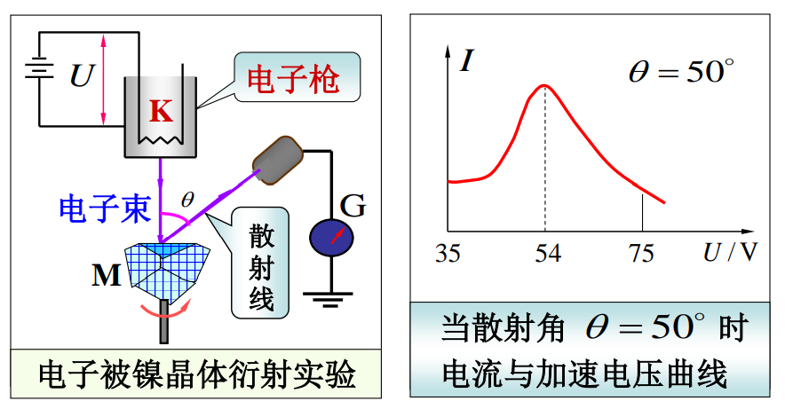
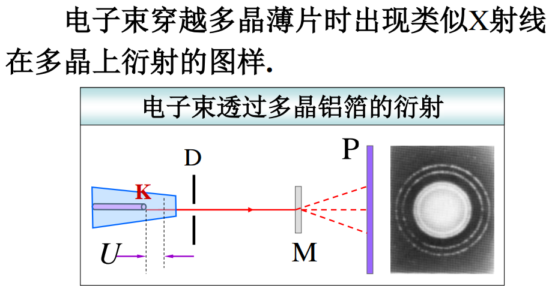

光学理论的发展，说明光的粒子性和波动性解释并不是对立的。而德布罗意则企盼把例子观点和拨动观点统一起来，给予“量子”以真正的含义。

## 德布罗意假设

德布罗意类比光的波粒二象性，把波粒二象性这一观念拓展到实物粒子领域内。德布罗意假设：**实物粒子具有波粒二象性**。
$$
\begin{align*}
\lambda =\frac{h}{p}=\frac{h}{mv}\\
\nu=\frac{E}{h}=\frac{mc^{2}}{h}
\end{align*}
$$
这种波被称为德布罗意波或概率波。

有以下两点值得注意：
1. *相对论效应在这里的影响*。当 $v<<c$ 时，以上公式中的 $m=m_{0}$；当 $v\to c$ 时，$m=\gamma m_{0}$。（10% c 为一般分界线）；
2. 宏观物体的德布罗意波长小到实验难以测量的程度，因此宏观物体仅表现出粒子性。

## 德布罗意波的实验证明    

### 戴维孙—革末电子衍射实验

### G.P. 汤姆孙电子衍射实验

## 德布罗意波的统计解释

**粒子性**解释：单个粒子在何处出现具有偶然性，但大量粒子在某处出现的多少具有规律性。粒子在各处出现的概率又不尽相同。

**波动性**解释：电子密集处，波的强度大；电子稀疏处波的强度小。

总和上述两种观点，可以得到结论：**德布罗意波为概率波**——在某处德布罗意波的强度与粒子在该处附近出现的概率成正比。