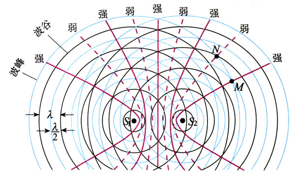

## 惠更斯原理

在研究和总结大量波动现象的基础上，荷兰物理学家惠更斯首次提出一种新的波描述方法：**介质中波动传播到的各点都可以看作发射子波的波源，而在其之后的任意时刻，这些子波的包络就是新的波前。**

通过惠更斯原理，可以解释很多波传播过程中的现象。理解惠更斯原理有助于后面进一步对波展开研究。

## 波的衍射

波在传播过程中遇到障碍物时，能够绕过障碍物的边缘，在障碍物的集合阴影区继续传播。这种现象称为**波的衍射**。可以使用惠更斯原来定性的分析波的衍射。

衍射现象的显著与否和障碍物的大小与波长大小纸币有很大关系。一般来说，在障碍物的宽度在适当程度内小于等于波长，衍射现象较为明显。
''
## 波的干涉

### 波的叠加

根据日常生活中的观察，可以得到两列波叠加时的特征，总结得到**波的叠加原理**：
1. 几列波相遇后，它们仍然保持各自原有的特征（频率、波长、振幅、振动方相等）不变，并按照原来的方向继续前进，好像没有遇到过其他波一样。
2. 在相遇区域任意点的唯一，为各列波单独存在时在各点所引起的振动位移的矢量和。

*以上波的叠加原理在一般来说都是正确的，但也存在不成立的情形，例如在波强度很大或非线性介质中传播时不满足以上定理。*

### 波的干涉

如上图所示，*频率相同、振动方向平行，相位相同或相位差恒定的两列波相遇时，使某些地方振动始终加强，而使另一些地方振动始终减弱的现象*称为**波的干涉**。波的干涉是波的一项重要特征，其与衍射现象都是作为判别某种运动是否具有波定性的主要依据。

能够产生干涉现象的两列波叫做**相干波**，而他们的波源就叫做**相干波源**。

根据两列波在某点处的单独的振动方程可以得到振幅最大和振幅最小的条件：
1. 振幅最大：$\Delta \phi = \pm 2k \pi$（等效于波程差为半波长的偶数倍）
2. 振幅最小：$\Delta \phi = \pm (2k+1)\phi$（等效于波程差为半波长的奇数倍）

通过利用干涉现象，可以实现在某些地点得到波的加强或波的减弱。