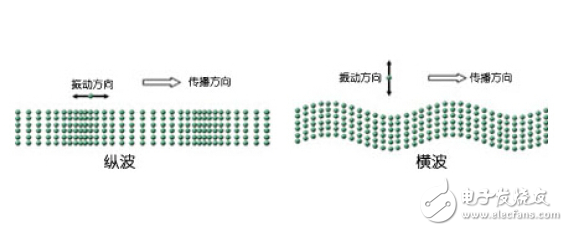

# 机械波的概念

## 波的形成

*机械振动在弹性介质中的传播就形成了机械波*。其本质原因是弹性介质内各质元之间有弹性力相互作用着。当介质中某一质元离开平衡位置时，临近质元对其施加弹性恢复力，使其回归平衡位置；同时由于牛顿第三定律，其临近质元也受其影响在自己的平衡位置附近开始振动。介质各部分之间的弹性力相互作用，最终使得振动由近及远的传播开去，最终形成了振动。

## 横波和纵波

如左图所示，振动方向与波的传播方向相垂直的波，称之为*横波*。其的外形特征为：传播方向上交替出现突起的*波峰*和凹陷的*波谷*，并且其以一定速度沿绳传播。

如右图所示，各质元振动方向与波的传播方向相平行的波称为*纵波*。其的外形特征为：传播方向上交替出现稀疏的*波疏*和稠密的*波密*，并且其以一定的速度传播出去。

**无论是横波还是纵波，其只有振动状态（振动相位）的传播，各质量元均在各自的平衡位置附近进行振动，没有随振动的传播而移动。**

## 基本参数

描述一列波，一般需要描述其的*波长、波的周期和波速*。

沿波传播方向两个相邻的、*相位差*为 $2\pi$ 的振动质元之间的距离，也即一个完整波形的长度叫做*波长*，一般用 $\lambda$ 表示。

波前进一个波长的距离所需要的时间叫做*波长*，一般用 $T$ 表示。周期的导数称为*频率*，其物理含义为单位时间内所传播的完整波的数目，一般用 $\nu(=\frac{1}{T})$ 来表示。由于在实际物理背景中，波源做一次完整振动，波就前进一个波长的距离，所以**波的周期等于波源振动周期**。

在波动过程中，某一振动状态（振动相位）在单位时间内所传播的距离称为*波速*，用 $u$ 表示，有时也称为*相速*。***波速的大小主要取决于介质的性质，在不同介质中波速往往不同。***

## 参量转换关系与波的实质

### 参量转换关系

由于在一个周期内，波会传播一个波长的距离，所以上述基本参量存在以下转换关系：$u=\frac{\lambda}{T}=\lambda\nu$。

### 波的实质

在弹性介质中形成*横波*时，必须是一层介质相对于另一层介质发生*横向*的平移，也即发生*切变*。在三种物质形态中，只有固体会发生切变，所以横波只能在固体中传播。我们给出描述固体的切变参量：*切变模量 G*，则根据理论与实验结果可以得到固体中横波的*波速*为：$u=\sqrt{\frac{G}{\rho}}$（$\rho$ 为密度）。

而在弹性介质中形成*纵波*时，介质要发生*压缩或拉伸*，也即发生*体变（有时也称之为容变）*，三态下的物体都会发生体变，所以纵波均可在其中传播。同样，给出描述固体的体变参量——*弹性模量 E*和描述液体的体变参量——*体积模量 K*，可以给出纵波波速：
$$\begin{array} \
u=\sqrt{\frac{E}{\rho}} (固体纵波) \\
u=\sqrt{\frac{K}{\rho}} (液体、气体纵波)
\end{array}$$

## 波的传播参量

波源在弹性介质中振动时，振动将向各个方向传播，形成波动。为便于定量描述波的传播，定义*波线、波面和波前*。

- 沿波的传播方向，绘制带有箭头的线，称之为*波线*。
- 把不同波线上相位相同的点连接形成的曲面称为*波面或同相面*。
- 由波源**最初**振动传到的各点所连成的*波面*称为*波前或波阵面*。
- 波面是球面的波称为*球面波*，波面是平面的波称为*平面波*
