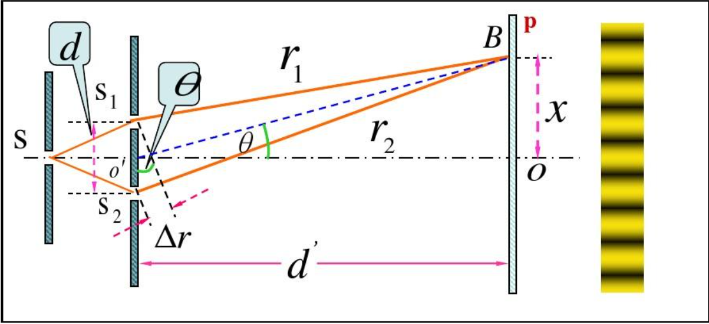
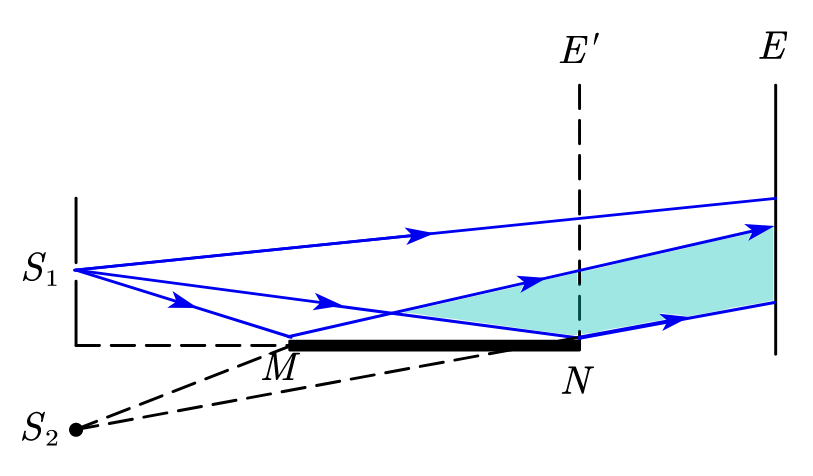

 作为最早应用[波振面分割法](相干光#波振面分割法)得到干涉现象的电性实验，杨氏双缝干涉实验是一个十分经典的光学干涉实验。在分析该实验的过程中，可以快速熟悉若干光学概念，掌握光学实验领域的一般分析方法。

劳埃德镜采用反射方法对杨氏双缝干涉实验进行了改良，在基本的杨氏双缝的条件下又追加了半个光程差的距离，通过学习该实验可以进一步了解双缝实验的原理与分析方法。

## 杨氏双缝干涉实验

### 实验流程与基本公式

如上图所示，设**双缝间距为 d**，**缝到光屏的距离为 $d'$**，则在屏幕上取一点，其到两个缝隙的距离分别为 $r_{1},r_{2}$。此时，光程差为 $\Delta r = r_{2}-r_{1}$。另外，因为一般实验同时要求条件：$d'\gg d$，故有 $\theta$ 很小，则根据几何关系，可以得到：
$$
\Delta r \approx d\sin\theta
$$

根据[光程与光程差](光程与光程差.md)一节的推导，不难得出上述条件下干涉加强（明条纹）条件为:
$$
d\sin\theta=\pm k \lambda,k=0,1,2\dots
$$
另外，如果要*讨论光屏上（亮）条纹的分布规律*，需要利用数学关系和几何关系：**$\sin\theta \approx \tan\theta = \frac{x}{d'}$**，带入上式有亮条纹分布规律为：
$$
x=\pm \frac{d'}{d}k\lambda,k=0,1,2...
$$
*同理暗条纹分布也可以推得，在此为避免混淆不加赘述。*

根据上述分析可以了解到对于双缝干涉来说，理论上条纹间距是相等的，且间距与*光的波长成正比，波长越小，条纹间距越小*。也正因如此，如果使用白色光做双缝干涉实验，则会出现不同光的*干涉极大位置错开*，形成彩色且连续的*光谱*。

### 叠加光强

假设两下风单独到达屏幕上任意点处的光强分别为 $I_{1},I_{2}$，则根据 [两个同方向同频率的简谐振动的合成公式](简谐振动的合成#两个同方向同频率的简谐振动的合成)，可以得到*相干*叠加后光强为：$I=I_{1}+I_{2}+2\sqrt{I_{1}I_{2}}\cos(\phi_{2}-\phi_{1})=I_{1}+I_{2}+2\sqrt{I_{1}I_{2}}\cos(2\pi \frac{\Delta}{\lambda})$ 。此时额外考虑到在杨氏双缝干涉实验中，干涉条纹是由振幅相等（光强相等）的两束光*相干叠加*得到的，则可以得到和光强为：
$$
I=4I_{0}\cos^{2}(\pi \frac{\Delta}{\lambda})
$$

对上述讨论进一步一般化，可以讨论一般条件下的光的叠加：$I=I_{1}+I_{2}+2\sqrt{I_{1}I_{2}}\cos(2\pi \frac{\Delta}{\lambda})$，该式子中的 $2\sqrt{I_{1}I_{2}}\cos(2\pi \frac{\Delta}{\lambda})$ 被称为*干涉项*，可以看到[光程差](光程与光程差.md)对该项其决定性作用。当两列光相干叠加时，其振幅成平方正比关系；而当两列光**不相干叠加**时，*干涉项*成周期性变化，在时间上取平均，则**合光强等于光强之和**。

### 空间相干性

通过实验可以观察到，在杨氏双缝干涉实验中，随着缝宽度的增加，干涉条纹会逐渐越发模糊，最后消失，这就是所谓的**空间相干性**。

## 劳埃德镜

劳埃德镜是与杨氏双缝干涉实验类似的一种干涉实验，但其相较于它的前身，它还额外揭示了**当光由光速较大的介质（光疏介质）到光速较小的介质（光密介质）是会发生相位跃变**的事实。

如图所示，光从狭缝 $S_{1}$ 中发出，一部分光直接照射到光屏 E ；另一部分光以平射进入镜面，发生反射与相位跃变，再照射到广平上。在这两种光共同照射的地方发生相干叠加，得到相干条纹。

由于该入射条件满足[光的相位跃变](光的相位跃变)条件，因此其相位会发生 $\pi$ 的跃变（也即光程差）发生半个波长的跃变。*额外需要说明的是，加减半个波长均可，其仅会影响答案表述，不会影响实际结果*。在物理中一般取加 $\frac{\lambda}{2}$