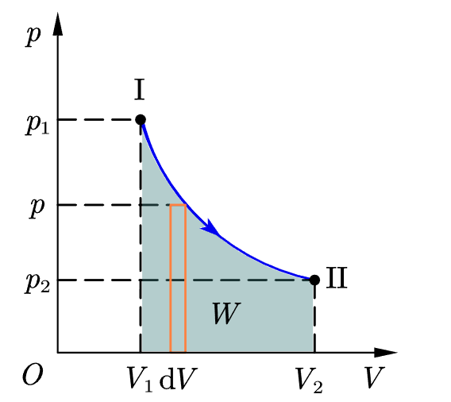
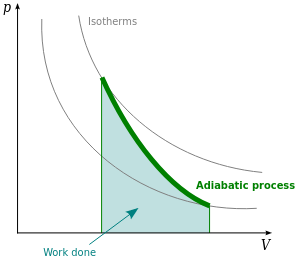

### 等温过程

在一个密闭的气缸内贮有理想气体，气缸与外部导热。当外界压力缓慢增大时，气缸内气体体积减小，压强增大；当外界压力缓慢减小时，气缸内气体体积增大，压强减小，而气体温度始终保持不变。这种气体变化过程叫做**等温过程**。由于[对于理想气体，内能是温度的单值函数](热力学第一定律和内能.md#内能是状态函数)，则气体内能也保持不变。其在 p-V 图上的过程曲线如图所示，该线我们一般称之为**等温线**。

在等温过程中，气体内能不变，由热力学第一定律有：
$$
dQ_{T}=dW_{T}=pdV
$$
说明在等温过程中，理想气体所吸收的热量全部用来对外做功。气体对外所做的功等于 p-V 图上等温曲线下面的面积。

设理想气体在等温过程中，其体积由 $V_{1}$ 变为 $V_{2}$ ，利用功的微分形式，对其积分，在利用理想气体物态方程，可以得到气体所做的功为
$$
\begin{align*}
W_{T}=&\int_{V_{1}}^{V_{2}}pdV\\
&=\nu R T\int_{V_{1}}^{V_{2}} \frac{dV}{V}\\
&=\nu R T\ln(\frac{V_{2}}{V_{1}})
\end{align*}
$$

同时用于所做的功全部来自吸收的热，则 $Q_{T}=W_{T}=\nu R T ln(\frac{V_{2}}{V_{1}})$

## 绝热过程

绝热过程是热力学过程中一个十分重要的过程。在气体的状态发生变化的过程中，如果它与外界之间没有热量传递，则这种过程叫做 **绝热过程**。本课程所讨论的绝热过程是进行的非常缓慢的准静态过程。其在 p-V 图上的过程曲线称为**绝热线**

### 绝热方程

在绝热过程中，距热力学第一定律，[内能是状态函数](热力学第一定律和内能.md#内能是状态函数)，以及 [理想气体物态方程](基本描述.md#理想气体物态方程)，可以得到：
$$
\begin{align*}
dE+dW_{a}&=0\\
\nu C_{V,m}dT+pdV&=0\\
(对气体物态方程微分：pdV+Vdp&=\nu R dT)\\
(整合以上两式)\ \ C_{V,m}pdV+C_{V,m}Vdp&=-RpdV\\\\
(代入比热容和迈耶公式)\ \ \ \  \gamma \frac{dV}{V}&=-\frac{dp}{p}\\
(积分)\gamma \ln V + \ln p &=C\\
pV^{\gamma}&=C\ \ (C是常量)\\
\end{align*}
$$

这就是理想气体绝热过程的 $p-V$ 函数关系。将理想气体状态方程代入，连同上式，可以得到**理想气体的绝热过程方程**，简称**绝热方程**。
$$
\begin{align}
pV^{\gamma}=C_{0} \\
V^{\gamma-1}T=C_{1}\\
p^{\gamma-1}T^{-\gamma}=C_{2}
\end{align}
$$

### 绝热过程的功

根据 $\nu C_{V,m}dT+pdV=0$，可以可以得到在有限过程中的理想气体所做的功为：
$$
W_{a}=\int pdV=-\nu C_{V,m}\int_{T_{1}}^{T_{2}}dT=-\nu C_{V,m}(T_{2}-T_{1})
$$

通过物态参量，可以对上式进行转化，得到：
$$
W_{a}=\frac{p_{1}V_{1}-p_{2}V_{2}}{\gamma-1}
$$

## 绝热线和等温线

绝热线比等温线更“陡峭”。
