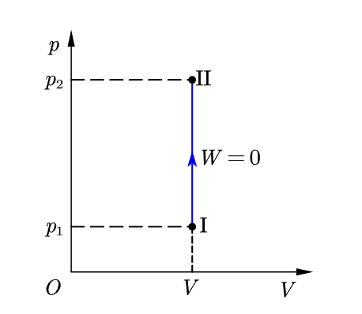
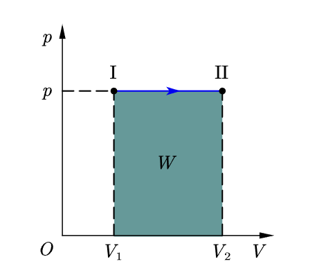

## 等容过程

在等容过程中，理想气体的体积保持不变，其在 $p-V$ 图上是一条平行与 $p$ 轴的直线，即**等容线**。

由于在等容过程中，气体的体积是常量，因此气体不对外做功，即 $dW_{V}=pdV=0$，由热力学第一定律，有：$dQ_{V}=dE$，通过积分，可以表示对于有限的等容过程，有：
$$
Q_{V}=E_{2}-E_{1}
$$
其表明，在等容过程中，气体吸收的热量全部用来增加气体的内能。

### 摩尔定容热容

设 1 mol 理想气体在等容过程中所吸收的热量为 $dQ_{V,m}$，气体的温度由 $T$ 升高到 $T+dT$，则气体的摩尔定容热容为：
$$
C_{V,m}=\frac{dQ_{V,m}}{dT}
$$
摩尔定容热容的单位名称为焦耳每摩尔开尔文，符号为 $J\cdot mol^{-1} \cdot K^{-1}$。

---

通过摩尔定容热容，我们可以较为容易的计算在等容过程中的热量（也即能量）变化。对摩尔定容热容的定义式进行变形，并有：
$$
dQ_{V,m}=C_{V,m}dT
$$
对于摩尔定容热容为 $C_{V,m}$，物质的量为 $\nu$ 的理性气体，在等容过程中，其温度由 $T_{1}$ 改变到 $T_{2}$ 的过程中所吸收的热量为：
$$
Q_{V}=\nu C_{V,m}(T_{2}-T_{1})
$$
---

同时，还由于等容过程本身的特性，以上推导等式的左边还可以换成气体内能 $E$
$$
dE=C_{V,m}dT
$$
对于摩尔定容热容为 $C_{V,m}$，物质的量为 $\nu$ 的理性气体，在等容过程中，其温度由 $T_{1}$ 改变到 $T_{2}$ 的过程中，其气体内能的增量为：
$$
E_{2}-E_{1}=\nu C_{V,m}\int_{T_{1}}^{T_{2}}dT=\nu C_{V,m}(T_{2}-T_{1})
$$
> 由于理想气体的内能只与温度有关，因此，对于**任意热力学过程**，我们都可以找到一个与其末态温度相同的等容过程来求其内能变化。因此气体的摩尔定容热容往往在各个地方用于**求内能**。

## 等压过程

在等压过程中，理想气体的压强保持不变，其在 $p-V$ 图上是一条平行于 $V$ 轴的直线，也即**等压线**。

在等压过程中，想气体传递的热量为 $dQ_{P}$，气体对外所做的功为 $pdV$，根据热力学第一定律，可以得到：
$$
dQ_{p}=dE+pdV
$$
其表明，在等压过程中，理想气体吸收的热量一部分用来增加气体的内能，另一部分使气体对外做功。有限的等压过程来说，想气体传递的热量为 $Q_{P}$，则有：
$$
\begin{align*}
Q_{P}&=E_{2}-E_{1}+\int_{V_{1}}^{V_{2}}pdV\\
Q_{P}&=E_{2}-E_{1}+p(V_{2}-V_{1})\\
\end{align*}
$$
### 摩尔定压热容

设 1 mol 的理性气体在等压过程中吸收热量 $dQ_{p,m}$，温度升高 $dT$，则气体的定压摩尔热容为 
$$
C_{p,m}=\frac{dQ_{p,m}}{dT}
$$
则对摩尔定压热容为 $C_{p,m}$ 物质的量为 $\nu$ 的理想气体，其在等压过程中所吸收的热量则为：
$$
Q_{p}=\nu C_{p,m}(T_{2}-T_{1})
$$

## 摩尔热容间的关系

### 差值

由于摩尔定压热容和摩尔定容热容的单位相同，利用热力学第一定律，改写摩尔定压热容的定义式，可以得到：
$$
C_{p,m}=\frac{dE_{m}+pdV_{m}}{dT} = \frac{dE_{m}}{dT} + p \frac{dV_{m}}{dT}
$$

由于 $\frac{dE_{m}}{dT}=C_{V,m}$，$p \frac{dV_{m}}{dT}$ 可以使用 $pdV_{M}=RdT$，转化为 $R$，则有：
$$
C_{p,m} - C_{V,m}=R
$$
### 迈耶公式

在[能量均分定理与理想气体内能](能量均分定理与理想气体内能.md)中，我们中能量按自由度均分定理出发，得到了物质的量为 $\nu$，自由度为 $i$ 的理想气体的温度改变 $dT$ 是，其内能相应的改变为：$dE=\nu \frac{i}{2}RdT$。将其与上一部分的公式整合，可以得到 
$$
C_{V,m}=\frac{i}{2}R\ \ \ \ \ C_{p,m}=C_{V,m}+R=\frac{i+2}{2}R
$$

### 比热容

在实际应用中，我们常常用到 $C_{p,m}$ 与 $C_{V,m}$ 的比值，这个比值通常用 $\gamma$ 表示，有：
$$
\gamma=\frac{C_{p,m}}{C_{V,m}}
$$
结合[迈耶公式](#迈耶公式)，另 $i$ 表示自由度，可以得到 $\gamma$ 的表示为：
$$
\gamma=\frac{i+2}{i}
$$