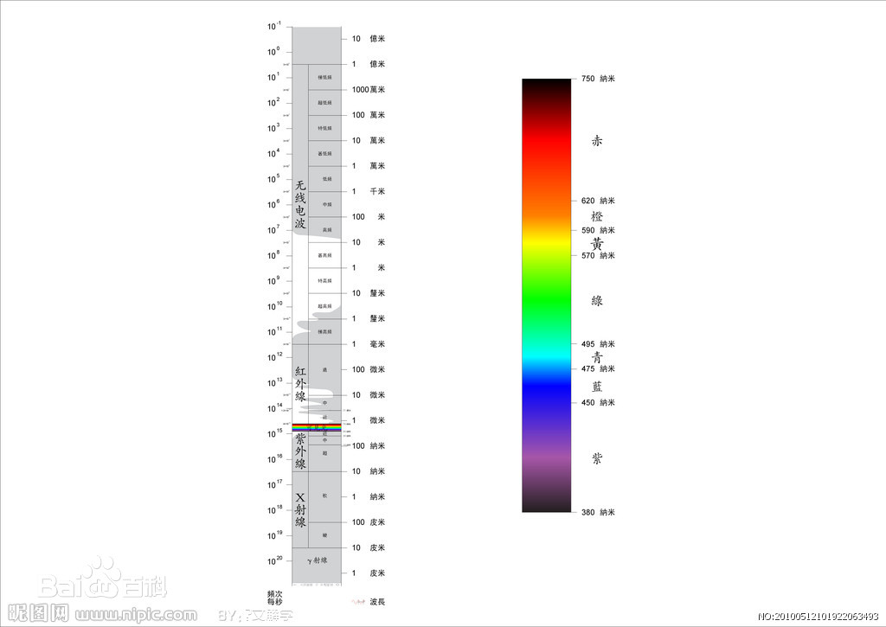

作为波的两种典型代表，声波和电磁波都具有广泛的应用。了解这两种具体的波，有助于我们进一步认识波。

## 平面电磁波

### 平面电磁波的波函数

在[电磁感应与电磁场](../学科知识/理科/电磁感应与电磁场.md)中，我们看到可以在 LC 振荡电路中得到稳定的电磁振荡。而当电路敞开后，电场和磁场的变化将向空间传播开去，形成电磁波。

通过将电极板展开，电容匝数减少，可以将一个 LC 振荡电路简化为一根直导线。这种改造后的 LC 振荡电路称为*振荡电偶极子*，其电偶极距呈周期性变化，为 $p=p_{0}\cos\omega t$。由于电偶极距不断发生变化，在其周边便产生周期性变化的*涡旋电场*与周期变化的*磁场*。随着时间的推移，电场和磁场一电磁波的传播速度向外扩展，便形成了电磁波。

电磁波的传播速度 $u=\frac{1}{\sqrt{\epsilon \mu}}$，其中 $\epsilon$ 和 $\mu$ 为介质中的电容率和磁导率。 

以振荡电偶极子为中心的球面上的电磁波，在距离原点很远时，近似于平面。此时，根据麦克斯韦方程组可以推到得到电场和磁场的公式：
$$
\begin{align}
	E=E_{0}\cos(\omega t - kx)\\
	H=H_{0}\cos(\omega t -kx)
\end{align}
$$
以上便是*平面电磁波的波函数*。

### 平面电磁波的特性

1. 电磁波是横波，其电场强度和磁场强度都垂直于波的传播方向。$E、H、u$ 三者互相垂直，构成右手系。
2. $E$ 和 $H$ 同相位。
3. $E$ 和 $H$ 的比值成比例，有 $\sqrt{\epsilon}E=\sqrt{\mu}H$
4. 真空中的电磁波速度等于真空光速。

### 电磁波的能量

以电磁波的形式传播出去的能量叫做*辐射能*，辐射能传播的方向就是电磁波传播的方向。

根据能留密度定义 $S=wu$ 以及电场能量和磁场能量定义式，可以得到电磁波的能留密度**矢量**为 $\vec S = \vec E \times \vec H$，该矢量成为**坡印廷矢量**。其平均值为 $\bar s=\frac{1}{2}E_{0}H_{0}$。

而考察作为波源的振荡电偶极子在单位时间辐射出去的能量，等于上式在以振荡电偶极子为球心的球面上的积分。取其时间平均值得到振荡电偶极子的*辐射功率 $\bar P=\frac{\mu p_{0}^{2} \omega^{4}}{12 \pi u}$*。

### 电磁波谱

实验表明，电磁波的辐射范围很广，波长没有上下限制，频率不同的电磁波具有不同的性质。为了方便表述不同波长的电磁波，人们按照电磁波波长（或频率）的大小依次排列做成*电磁波谱*。

## 声波

机械振动在弹性介质中的传播能够形成机械波。当机械波的频率在 20Hz~20kHz 之间时，能够引起人的听觉，因此这一频率段内的机械波被称为声波，而低于 20Hz 的波被成为次声波，高于 20kHz 的波被成为超声波。同时，在流体中传播的声波都是**纵波**。

声波的能流密度被成为声强 $I$，单位为 $W\cdot m^{-2}$。由于人耳对于声强的变化并不敏感，所以在声学中往往用声强的对数来标度声强级别，声强级 $L_{I}$ 的定义为：$L_{I}=10lg \frac{I}{I_{0}}$。

### 超声波

频率高于 20kHz 的机械波形成超声波，其具有许多富于应用价值的特性。下面进行简单列举：
1. 极强的定向功能
2. 极大的声强（碎石）
3. 附加声压大，会造成短时间内介质的拉压作用，在液体中形成空穴或空化现象，导致液体瞬间破裂，形成小气泡；尺寸匹配的小气泡还能引起共振，带来升温、升压与放电的效果。
4. 穿透本领大，能在固体中传递几十米。
5. 有显著的反射效果

### 次声波

频率在 $10^{-4}~20$ Hz 之间的机械波被成为次声波。在很多自然现象中都会有次声波的产生。其频率地，衰减小，能在大气中传递几千公里。某些频率的强次声波能引起人疲劳甚至失明，会有一定的危险。