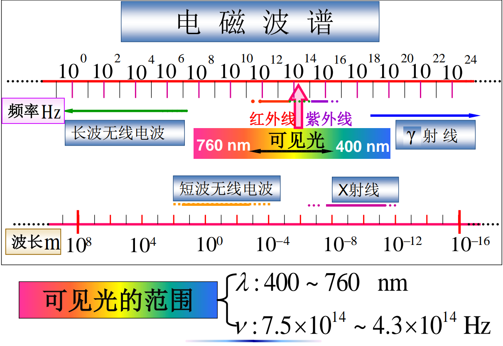

[干涉现象](惠更斯原理、衍射和干涉#波的干涉)是波动过程的基本特征之一。对于*频率相同、振动方向相同、相位差恒定*的两个波源所发出的波是相干波，在两相干波相遇的区域内，有些点的振动始终加强，有些点的相位始终减弱，也即产生干涉现象。

## 相干光与相干光源

由于光波也是一种[电磁波](电磁波和声波#平面电磁波)，其自然也会产生干涉。其振动的物理量有电场强度 $\vec E$ 和磁场强度 $\vec H$。其中，**电场强度 $\vec E$** 能够引起人眼或底片感光，因此一般把 $\vec E$ 称为*光矢量*。若两束光的*光矢量*满足*相干条件*，则称其为**相干光**，相应的光源为**相干光源**。

## 光的干涉难以观察的原因

对于机械波和人造的无线电波的干涉现象较为容易，这是由于其*波源固定且波源发出的波是连续不断的正弦波*，相干条件较容易满足。

而对于光，其发光原理是光源中的原子或分子的运动状态发生变化时辐射出来光。单个原子发光持续时间较短，真正的光往往是有大量原子或分子互相独立发出的。也就是说，自然光一般是由若干彼此独立、方向随机的波列叠加而成。也因此，往往难以直接通过两个一般光源观察到光的干涉现象。

## 相干光的获取

正如上文所述，直接选取两光源难以满足要求，因此我们考虑将*一个*普通光源上*一个*点发出的光*利用反射或折射*将之一分为二，再将之叠加来制作相干光，观察干涉现象。而根据如何分割光，有两种较为常用的方法：**振幅分割法**和**波振面分割法**。

### 振幅分割法

将一个普通光源上*一个点*发出的光，利用反射或折射的方法，使其一分为二，在两个不同的路径上传播，使其产生一定的[光程](光程与光程差.md)后再相遇得到干涉现象的分割方法叫做振幅分割法。

日常生活中所见到的各种薄膜呈现的彩色等现象都是振幅分割自然光得到的干涉现象。

### 波振面分割法

对于单频率激光光源来说，从其激光器窗口输出的光都具有相干性，能够较为简单的展示干涉现象。

将激光器的光通过一个单缝得到[光程](光程与光程差.md)相同的一个波振面，再使其通过一个双缝，利用惠更斯原理便能够得到一对相干光源。通过该相干光源，便可以观察到光的干涉现象。

## 干涉后的光强分布

两束相干光叠加后的振幅为：$A=\sqrt{A_{1}^{2}+A_{2}^{2}+2A_{1}A_{2}\cos(\phi_{2}-\phi_{1})}$ 其中 $\Delta \phi = \frac{2\pi}{\lambda}\Delta$