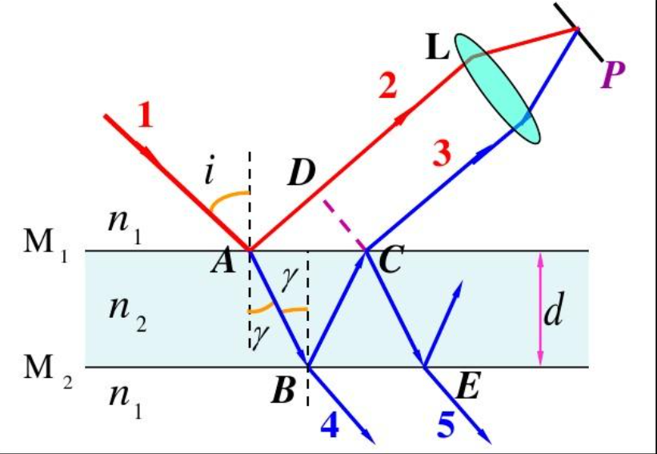
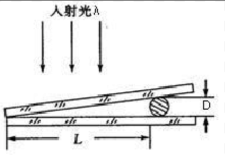
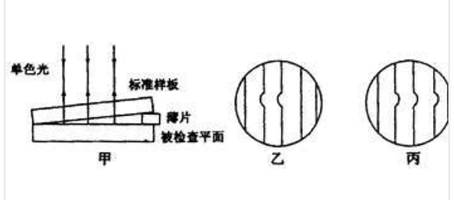
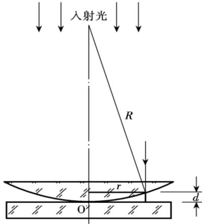
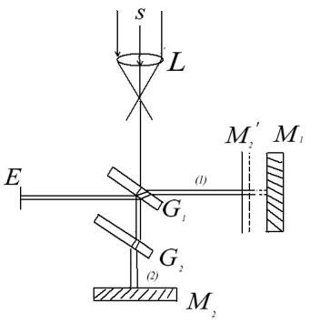
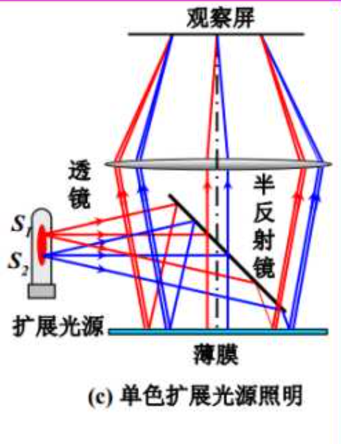
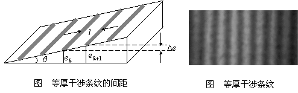

作为常见的光的干涉现象，也是一种常见的[振幅分割法](相干光#振幅分割法)的应用，薄膜干涉的相关讨论也有助于进一步熟悉光学分析方法。

在开始本节之前，首先说明一点：**透镜不会引起额外光程差**。通过透镜的各条光束

## 薄膜干涉的光程差

如上图，在折射率为 $n_{1}$ 的外部均匀介质中有一折射率为 $n_{2}$ 的薄膜。从光源发出的光 1 从 A 点入射，一部分反射形成光线 2，另一部分在薄膜折射后在 B 点反射，从 C 点出射形成光线 3。通过透镜将 2、3 汇聚到统一点 P 便利用振幅分割法得到了光的干涉图样。

通过对比 2、3 光路，根据定义可以得到光程差的原始描述为：$\Delta = n_{2}(AB+BC)-n_{1}AD$。利用几何关系与光学关系，可以描述其的**反射光程差**为：
$$
\Delta_{r}=2d\sqrt{n_{2}^{2}-n_{1}^{2}\sin^{2}i}+  
       \frac{\lambda}{2}
$$

特别的，膜上、中、下三种介质可以进行进一步探讨：介质的折射率会反应介质的光密、光疏特性，而光密、光疏特性则与是否引起额外光程差密切相关。通过穷举与讨论，可以得到结论如下：
1. 当上、中、下三种介质的折射率依次递增或递减时，反射光程差为：$\Delta_{r}=2d\sqrt{n_{2}^{2}-n_{1}^{2}\sin^{2}i}$
2. 当不满足条件 1 时，其反射光程差为：$\Delta_{r}=2d\sqrt{n_{2}^{2}-n_{1}^{2}\sin^{2}i}+  \frac{\lambda}{2}$

另外，对于透射光讨论也可以得到类似的（*互补*）结论：
1. 当上、中、下三种介质的折射率依次递增或递减时，反射光程差为：$\Delta_{r}=2d\sqrt{n_{2}^{2}-n_{1}^{2}\sin^{2}i}+\frac{\lambda}{2}$
2. 当不满足条件 1 时，其反射光程差为：$\Delta_{r}=2d\sqrt{n_{2}^{2}-n_{1}^{2}\sin^{2}i}$

实际上，这种互补性的来源可以被认为是能量守恒——透射光强度与反射光强度的和总应与入射光强度相等。

## 薄膜干涉的应用

薄膜干涉的主要应用有：测量薄膜或波长的厚度、增加透射率或反射率、测量膨胀洗漱与表面平整度检验等，下面举几种特殊的薄膜干涉来说明以上应用。

### 增透膜与增反膜

选用具有特定折射率的材料构建特定厚度的薄膜，光线将会在薄膜的前表面与后表面发生反射，此时便可以利用薄膜干涉的光程差的特性实现透射率和反射率的提高。

对于这类引用，目标光线往往是垂直表面入射，也即入射角为 $0\degree$。设薄膜折射率为 n，薄膜厚度为 d，因此一般公式为：$2nd+(\frac{\lambda}{2})=\frac{2k/2k+1}{2}\lambda$。**同时，还需要进一步考虑三种介质折射率的关系，修正一般公式才能得到正确结论。**

### 劈尖干涉

将两片平板玻璃叠放在一起，其一端相互接触，另一端用直径为 D 的细丝隔开。此时在两玻璃平板中形成一个*空气薄膜*，称该空气薄膜为**空气劈尖**。当一束光垂直入射到劈尖时，其劈尖上下两界面处反射的光发生薄膜干涉，便可以在劈尖上表面观察到干涉条纹。*一般称两相邻条中心的间距 b 为劈尖干涉的**条纹宽度**。*

由于劈尖的构造自动满足了*不顺*的条件，其反射光的干涉极大条纹条件为：$2nd+ \frac{\lambda}{2}=k\lambda$（n 为劈尖介质折射率，一般为空气取 1）。且在两玻璃片接触点处，其光程差自动满足暗条纹条件，其表现为暗条纹。

另外，根据上述结论，两相邻条纹的厚度差应满足为：$2n(d_{k+1}-d_{k})=\lambda$（n 为劈尖介质折射率，一般为空气取 1）。

同时，条纹宽度也可以表示为：$\frac{\Delta d}{\tan \theta}$ 。如果 $\theta$ 足够小，应该有 $\tan\theta = \frac{D}{L}$，因此条纹间距 $b=\frac{\lambda}{2n} \cdot \frac{L}{D}$，且条纹数目为 $n=\frac{L}{b}=\frac{2nD}{\lambda}$。该公式说明，对于薄膜干涉而言，只要角度不过于离谱，则**在高度差恒定的条件下，条纹密度会变化但条纹数目不会发生变化。**。

综合以上推导，便可以使用劈尖来测量细丝直径或者入射光的波长。

另外，由于劈尖对与形变非常敏感，且在选择合适参数的条件下，其干涉条纹可以通过肉眼直接观察到，故劈尖也会被用于平整度检查和测量物体热膨胀系数。

### 牛顿环

牛顿换的实验装置图如图所示，一块半径很大的球体的一部分与平玻璃相接触 （R>>d），构成一个*上表面为球面、下表面为平面的空气劈尖*。入射光在该空气劈尖处发生干涉，形成一系列明暗相间的同心圆环。

其光程差与劈尖相同，也为：$\Delta = 2nd + \frac{\lambda}{2}$。利用几何关系可以推演明、暗环的半径公式（$d$ 很小，视作 $d^{2}=0$ ）。

类似于劈尖，其中心处也是暗环。

### 迈克尔孙干涉仪

迈克尔孙干涉仪是十分经典的一种装置，现代许多干涉仪器都是由其衍生而来。其基本光路图如图所示。其中 $L$ 为光源，$M_{1},M_{2}$ 为两片反射镜， $G_{1},G_{2}$ 为平板玻璃其中 $G_{1}$ 远离光源的一面镀半透半反膜。

来自光源的光经过透镜后平行射 $G_{1}$，一部分被 $G_{1}$ 反射到 $M_{1}$。经 $M_{1}$ 反射向 $E$ 传播；另一部分透射到 $M_{2}$，经 $M_{2}$ 反射后返回 $G_{1}$，并向 $E$ 传播。显然，该仪器使用了[振幅分割法](相干光#振幅分割法)来得到两列相干光。*需要特别说明的是，光在透射过 $G_{1}$ 再返回到 $G_{1}$ 的过程中穿过了两次 $G_{2}$，$G_{2}$ 的作用是使得两列光都穿过三次厚度相同的平玻璃，来利用几何距离差直接表示光程差，避免额外的光程差，因此其也被称为补偿玻璃*

通过精巧的实验设计，只需记录反射镜移动的距离 $\Delta d$ 和变化的条纹数目 $\Delta n$，便利用迈克尔孙干涉仪方便的测量波长。其对应关系为：
$$
\frac{2\Delta d}{\Delta n}=\lambda
$$

## 等倾干涉与等厚干涉

### 等倾干涉

在薄膜厚度一定的条件下，具有相同入射角的各光线的光程差相同，因此其也同时具有相同的干涉情况。这种干涉就被称为*等倾干涉*，形成的条纹就被称为*等倾干涉条纹*。

**装置原理**：上图所示的就是观察等倾干涉条纹的装置的原理图。其中拓展光源 S 是就有一定发光面积的面光源。首先考虑光源上一个发光点所发出的光，在这些光线中，*能够以相同入射角入射的光处于同一圆锥面上*，其在薄膜上反射的通过透镜汇聚后在焦平面上形成一个*圆形*条纹。因此，不同角度入射的光会形成不同半径的圆形条纹。因此就形成了一系列的干涉条纹，也就是*等倾干涉条纹*。

另外，值得注意的是，不同点发出的光会各自形成等倾干涉条纹，而其互相之间却并不**满足相干条件**，故其*非相干叠加*，从而*提高了条纹的对比度*。

此处利用面光源不会引起空间相干性的问题，而这也就是常用拓展光源观察等倾干涉的原因。

### 等厚干涉

对于空气劈尖来说，劈尖内厚度相同的地方的干涉条件相同，因此劈尖的干涉条纹是一系列平行与劈尖棱边的明暗相间的直条纹。其厚度相同的地方干涉条纹的亮度相同，这种现象称为*等厚干涉*，形成的条纹称为等厚干涉条纹。

> 不过如果用牛顿环来做等厚干涉的化就会是圆形了吧...