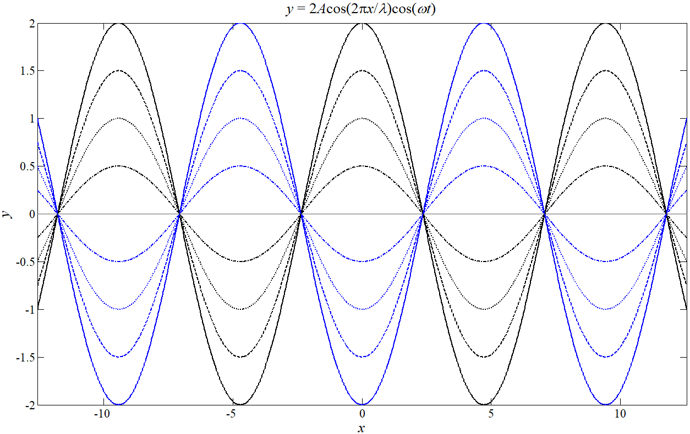

*驻波*是一种特殊的波的形式，其可以通过特殊的干涉现象来产生。

在驻波产生时，弦线被分为长度相等的，做**稳定**振动的几个部分，在整个弦线上没有波形的传播，线上的各点的振幅也各不相同，有些点始终静止不动，而另一些点的振动最强。这种波就称为**驻波**。

驻波是由**振幅、频率和传播速度相同的两列相干波，在统一直线上沿着相反方向传播时叠加形成的一种*特殊形式的干涉现象*。**

## 驻波方程

我们以在弦线上传播的一列波为例，其原波的方程和反射波的方程分别为：$y_{1}=A\cos2\pi(\nu t-\frac{x}{\lambda}+\phi),y_{2}=A\cos2\pi(\nu t + \frac{x}{\lambda}+\phi)$，通过将两方程加和并通过和差化积公式整理，得到驻波方程：$y=2A\cos \pi \frac{x}{\lambda}\cos 2\pi \nu t$。（从方程形式上可以明显看到其不满足行波方程。）

## 驻波性质

分析上一节得到的驻波方程，可以得到以下几条驻波的性质

### 波节与波腹

弦线上的各点都做振幅为：$|2A\cos \pi \frac{x}{\lambda}|$ 的简谐振动，所以凡是满足 $|\cos \pi \frac{x}{\lambda}|=0$ 的点都*始终静止不动*，叫做**波节**，而满足 $|\cos \pi \frac{x}{\lambda}|=1$ 的点其振幅始终最大，因此这些点称为**波腹**。

根据三角函数相关公式，可以得到两相邻波节或波腹之间的距离为 $\frac{\lambda}{2}$。

### 位置与相位

弦线上各点的相位与 $\cos(2\pi \frac{x}{\lambda})$ 的正负有关，波节两边的点具有相反的符号，相等距离的点相位相反。弦线以波节为分界点，分段振动。

### 相位跃变

在波长满足一定的条件时，波在某固定点处发生反射时会形成波节，而在其他情况下则会形成波腹。在介质分界处到底是形成波节还是波腹与波的种类、介质性质等多方因素都有关。而*对于机械波来说，决定性因素为介质的**波阻**，（介质密度乘以介质中的波速，也即$\rho u$）*。从波疏介质到波密介质入射时会形成波节，而从波密介质到波疏介质会形成波腹。

而如果形成波节，说明入射波和反射波在此处相位时刻相反，即反射波在分界处发生了 $\pi$ 的相位跃变，这种现象往往被称为*相位跃变 $\pi$*，或形象的称为“半波损失”。

### 驻波的能量

驻波的能量即包括势能，也包括动能。

- 当驻波上各个点（除去波节以外），都达到最大位移时，此时全波不具有动能，仅具有势能，*越靠近波节，势能越大*；
- 到驻波上各个点都位于平衡位置附近时，各点都具有最大的动能，*越靠近波腹，动能越大*。

因此可以总结得到，**在弦线上形成驻波时，动能与势能不断相互转化，形成了能量交替地由波腹传递到波节，在反向传播回来的情形**，这说明驻波的能量没有定向的传播。也因此，称驻波是整个物体进行的一种特殊形式的振动。

### 驻波的简正模式

驻波的形成需要一定的条件，对于具有一定长度且**两端固定 (两端均为波密介质)** 的弦线来说，如果需要形成驻波，则要求波长与弦线长度之间满足以下关系式：
$$
l=n \frac{\lambda_{n}}{2},n=1,2,...
$$
以上条件中，弦线长度不能任意取，只能去固定长度，因此也可以视作为一种*量子化*。同时，根据频率与波长的关系，可以反向写出频率应该满足的关系：
$$
\nu_{n}=n \frac{u}{2l},n=1,2,...
$$
每一种可能出现的频率都称为弦线的**本征频率**，其决定的振动方式都称为**简正模式**。各本征频率中，频率最低的为**基频**，其他频率称为**谐频**（音乐理论中成为*范频*）。

而对于一段波密而另一端波疏的介质条件，其基频为 $\nu_{1}= \frac{u}{4l}$，谐频为基频的奇数倍。

特别的，当外界驱动频率和振动系统的某个本征频率相同时。就会引起高强度的驻波，这种现象被成为*共振或谐振*，